# Security Monitoring with Wazuh

## Overview
This project demonstrates how to deploy Wazuh for **security monitoring, log analysis, and threat detection** on Linux and Windows systems. It includes **three security use cases:**
- **Task #1:** Deploying a Wazuh Server and Onboarding an Ubuntu Agent.
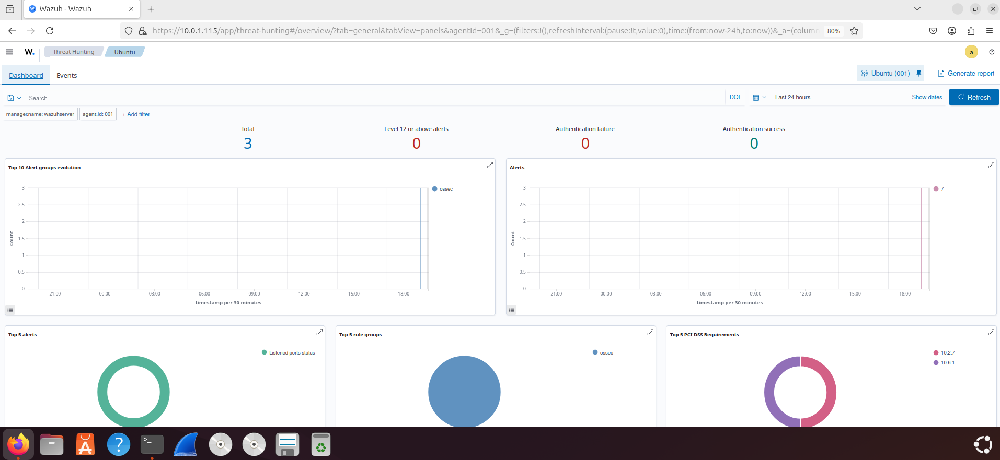
- **Task #2:** Detecting Unauthorized File Changes on a Windows Machine.
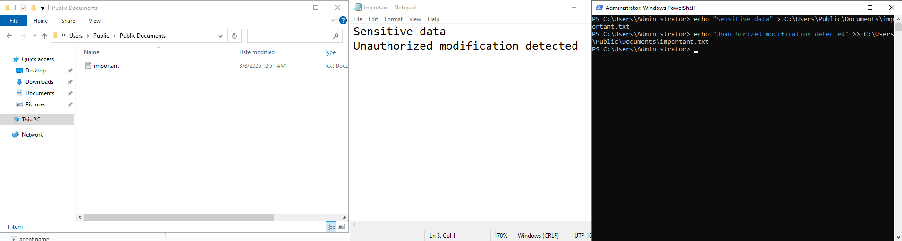
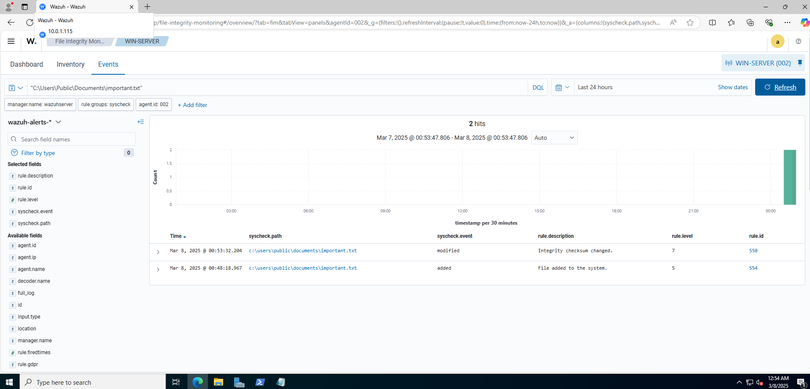
- **Task #3:** Detecting SSH Brute-Force Attacks on an Ubuntu Machine.
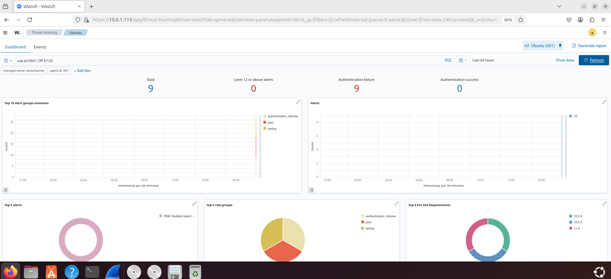


## Objectives
- Install and configure **Wazuh Server** using the Quick Start method.
- Onboard an **Ubuntu agent** and monitor logs.
- Implement **File Integrity Monitoring (FIM)** to detect unauthorized file changes on Windows.
- Simulate and detect **SSH brute-force attacks** on Ubuntu using **Hydra**.
- Analyze security logs and alerts using **Wazuh Dashboard**.

## Technologies Used
- **Wazuh** (SIEM & Security Monitoring)
- **Ubuntu 22.04** (Wazuh Server, Kali Linux Attack & Ubuntu Target Machine)
- **Windows 10/11** (FIM Target Machine)
- **Hydra** (For brute-force attack simulation)
- **Kibana & Elastic Stack** (Log analysis & dashboards)

## Implementation Steps
### ** Deploy Wazuh Server**
```bash
curl -sO https://packages.wazuh.com/4.8/wazuh-install.sh && sudo bash ./wazuh-install.sh -a
```
## Onboard an Ubuntu Agent
```bash
curl -sO https://packages.wazuh.com/4.8/wazuh-agent-linux.sh && sudo bash wazuh-agent-linux.sh
```

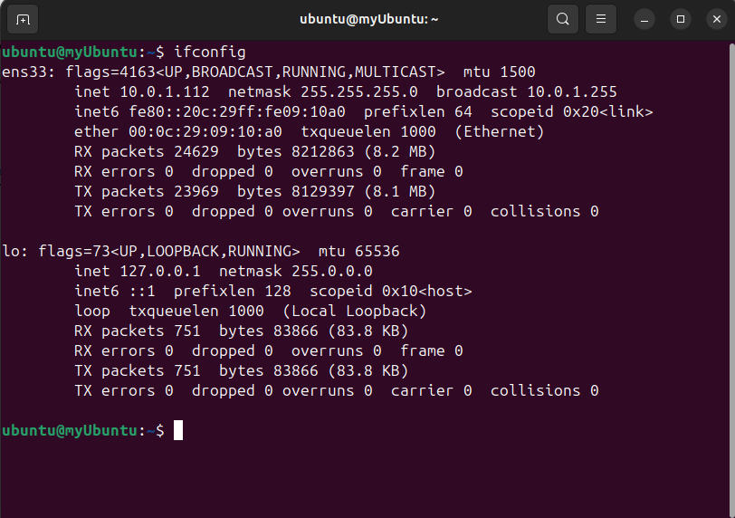
## Configure File Integrity Monitoring (FIM) on Windows
- Install Wazuh agent on Windows.
- Modify ossec.conf to monitor C:\Users\Public\Documents.
- Simulate unauthorized file changes.
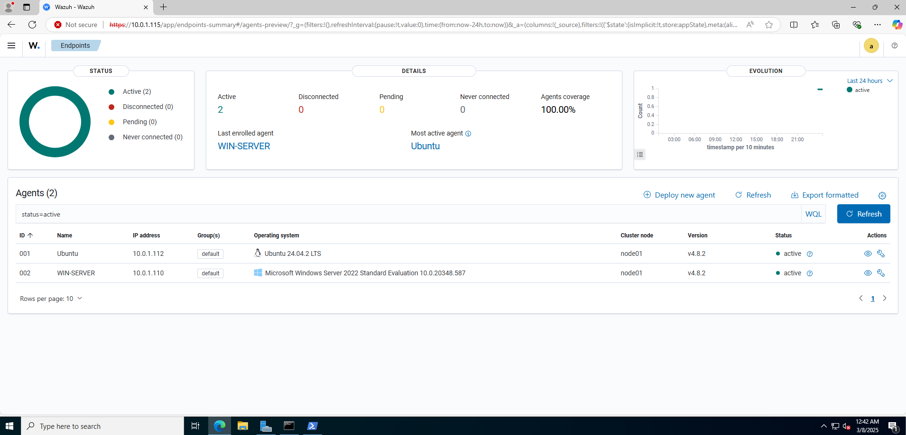

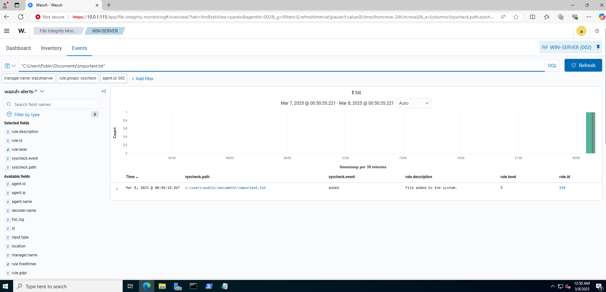
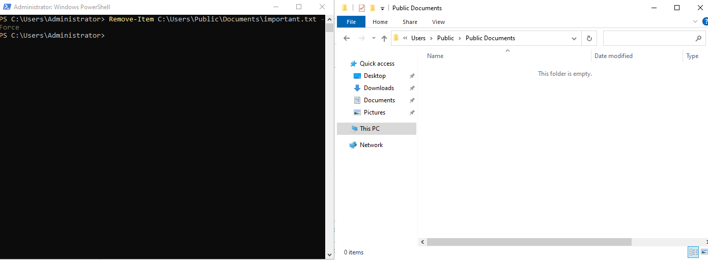
# Detect SSH Brute-Force Attacks
- Simulate brute-force attacks using Hydra.
```bash
hydra -l ubuntu -P /usr/share/wordlists/rockyou.txt <target-IP> ssh
```
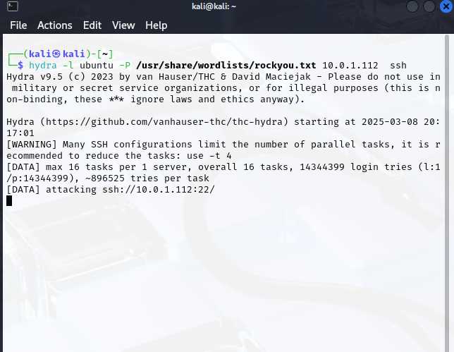
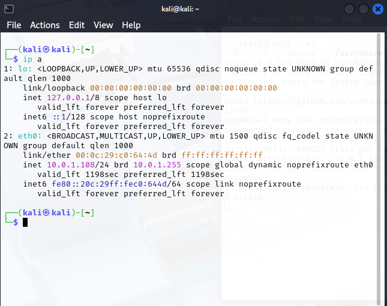
- Detect attacks using Wazuh alerts.

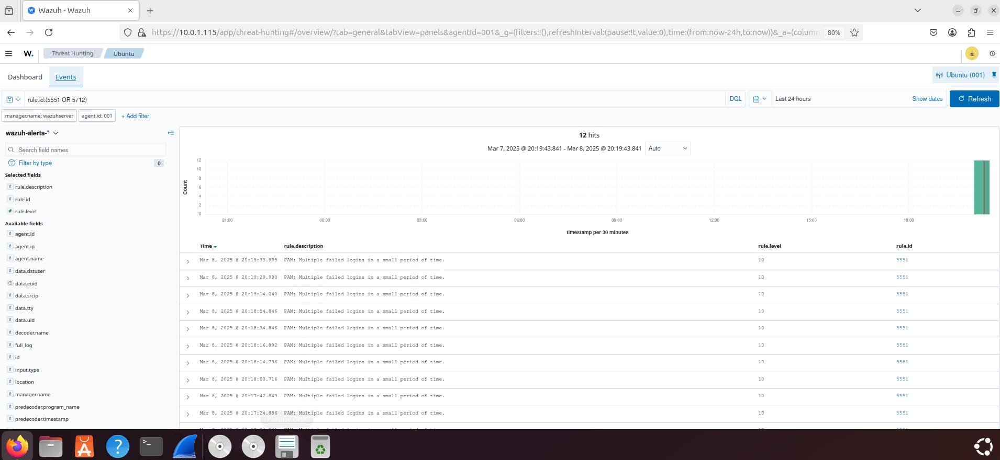
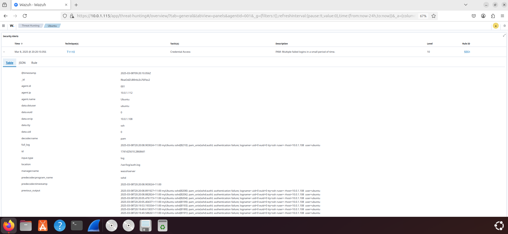

## Results & Findings
✅ Successfully deployed Wazuh Server and onboarded agents.
✅ Detected unauthorized file modifications using Wazuh FIM.
✅ Identified SSH brute-force attacks through security event logs.
✅ Learned SOC analyst techniques for security monitoring.

## Screenshots
** Available in screenshots folder **
